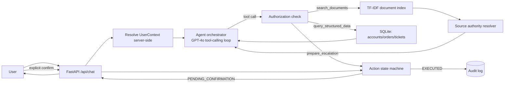

# ParcelPilot Support / Operations Copilot

## Overview

An internal chatbot for authorised ParcelPilot support/operations staff. It answers
natural-language questions about accounts, orders, tickets, policies, SOPs, and
customer agreements; enforces access control and source-authority rules in code
(not just in the prompt); and gates any state-changing action behind an explicit,
separate user confirmation. A rule-based "Ops Insights" view (Problem 1: Proactive
Issue Detection) surfaces recurring or urgent issues across open tickets.

## Key Features

- Natural-language chatbot over the supplied data pack only
- Document retrieval with preserved source metadata (type, version, status, authority)
- Structured account/order/ticket lookup and calculation via bounded operations
- Multi-step tool use (order → account → agreement → policy → calculation → decision)
- Deterministic source-authority resolution: customer agreement > current policy/SOP
  > current product docs > deprecated policy > historical ticket (context only)
- Access control enforced at the tool/data layer, never trusted from the frontend or model
- Confirmation-gated escalation action with a real state machine and audit log
- Proactive issue detection (rule-based, manager/admin-only view)

## Architecture



## Technology Stack

- **Backend:** Python + FastAPI — fast to build, good SQLite/embeddings ecosystem, easy to test.
- **Structured data:** XLSX ingested into SQLite at startup; pandas used only during ingestion,
  never as the live query engine. All runtime reads go through named, parameterized functions.
- **Retrieval:** local TF-IDF index (scikit-learn), not a managed vector DB. The corpus is 6
  short documents / 23 chunks — an embedding-based vector store would add infra risk without
  adding retrieval quality at this scale, and is easy to swap in later (see PRODUCT.md).
- **Agent:** a small explicit tool-calling loop against the OpenAI Chat Completions API (gpt-4o), not LangGraph
  — easy to explain end-to-end in a short demo.
- **Frontend:** single-file HTML/JS chat UI (no build step), showing tool activity and
  confirmation cards inline.

## Agent Tools

1. **`search_documents(query, document_types?, customer_id?, top_k)`** — searches policies,
   SOPs, the product ops guide, and customer agreements. Returns chunks with full metadata
   and the authority resolution already applied in code.
2. **`query_structured_data(operation, params)`** — bounded operations only
   (`get_account`, `get_order`, `get_ticket`, `list_account_orders`, `list_account_tickets`,
   `find_tickets_by_issue`, `calculate_pickup_delay_hours`, …). No arbitrary SQL is ever
   exposed to the model.
3. **`prepare_escalation(account_id, reason, related_id?)`** — creates a `PENDING_CONFIRMATION`
   action. Execution only happens via a separate `POST /api/actions/{id}/confirm` call.

## Source Authority Model

`customer agreement (1) > current policy/SOP (2) > current product docs (3) > deprecated policy (4) > historical ticket resolution (5, context only, never authoritative)`

Implemented in `backend/app/reliability/authority.py`, driven by metadata in
`config/document_registry.yaml` — every field in that file was verified directly against
the actual PDF content, not assumed.

## Access Control

Enforced in `backend/app/security/auth.py` and re-checked inside every function in
`backend/app/tools/structured.py` and `backend/app/tools/actions.py`. `UserContext` is
resolved server-side from a demo session table — an account ID or role supplied by the
model or the frontend is never trusted as ground truth; it is only used to look up the
real, server-held permissions.

## Confirmation Workflow

See `backend/app/tools/actions.py`. States: `PENDING_CONFIRMATION → CONFIRMED/EXECUTED`
or `→ CANCELLED`. Re-confirming an already-`EXECUTED` or `CANCELLED` action is rejected
(no replay, no double execution) — verified in `backend/tests/test_action_confirmation.py`
and over real HTTP during development.

## Data Ingestion

`scripts/ingest.py` loads the XLSX into SQLite (`accounts`, `orders`, `tickets` tables, real
column names) and builds the document index from the 6 PDFs using metadata from
`config/document_registry.yaml`. Safe to rerun — drops and recreates tables/index each time.

## Local Setup

```bash
git clone <this-repo>
cd parcelpilot-ai
cp .env.example .env
# edit .env and set OPENAI_API_KEY (required for live chat)

pip install -r backend/requirements.txt
python scripts/ingest.py

cd backend
uvicorn app.main:app --reload --port 8000
```

Open `frontend/index.html` directly in a browser (it targets `http://127.0.0.1:8000`).

## Running Tests

```bash
cd backend
python -m pytest tests/ -v
```

15 tests, all passing without any API key (they exercise the deterministic tool/data layer
directly). Covers: both assessment example questions, one additional generalization record,
authorization boundaries, current-vs-deprecated precedence, historical-ticket non-authority,
and the full confirmation state machine including replay/double-execution rejection.

## Demo Users

| user | role | account scope |
|---|---|---|
| `agent_rohit` | support_agent | ACCT-001, ACCT-003 |
| `agent_maya` | support_agent | ACCT-002, ACCT-004 |
| `manager_priya` | support_manager | all accounts + Ops Insights |

## Example Queries

- "Can Northstar cancel ORD-1001 without a cancellation fee? Explain why." (assessment example)
- "A pickup on ORD-2002 is late because of carrier fault — should LumenWorks get a service credit?" (assessment example, applied to a real record)
- "Can Beacon Retail cancel ORD-3001 without a fee?" (generalization — no customer agreement exists for this account)
- "TKT-501 says Northstar can't create any shipments — what's going on and what should we do?"
- "TKT-450 said a fee applied — is that still correct for Northstar?" (tests historical-ticket handling)

## Important Technical Decisions

See `docs/ARCHITECTURE.md`.

## Known Limitations

- **Live chat is confirmed working end-to-end**, both locally and on the hosted deployment,
  using OpenAI's gpt-4o via `OPENAI_API_KEY`. Every deterministic component (ingestion, tools,
  authorization, source authority, action confirmation, ops insights) passes the full test suite
  without a key.
- No demo video is included yet.
- Proactive issue detection is intentionally simple keyword-based clustering, not ML.
- Retrieval is TF-IDF, not embeddings (see Technology Stack rationale).

## AI Tool Usage

This project was built with Claude assistance (architecture planning, code generation,
debugging, and documentation drafting) inside an Anthropic chat/agent environment.
Architectural decisions (source-authority model, access-control placement, confirmation
state machine design), the schema-verification step against real files, and all test
assertions were reviewed against the actual PDF/XLSX contents rather than assumed. Two
real bugs (a timezone mismatch in delay calculation, a hardcoded path in a test) were
found and fixed via the test suite during development, not left for the evaluator to find.

## Hosted Application

Live at: https://parcelpilot-ai.onrender.com

Note: this is a free-tier Render instance, so it spins down after inactivity — the first
request after idle time may take 30–50 seconds to respond while the instance wakes up.

## Demo Video

_Not yet recorded — see Known Limitations._
